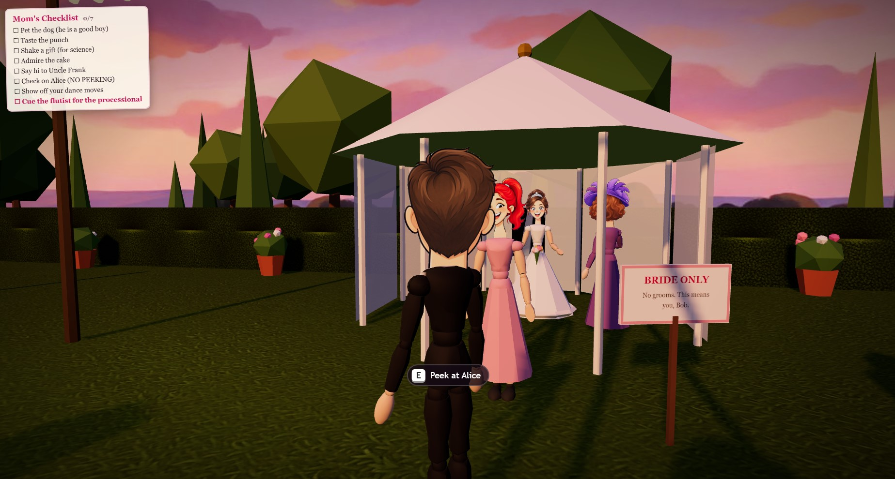

# A Wedding Game

This game was vibecoded with Claude Opus 5.5 and was never meant to be shared. It started as a private
project, but it turned out to be fun enough that sharing it seemed worthwhile.

A short (5–8 min), replayable comedy game in three.js. You're the groom at a golden-hour garden wedding.
Work through Mom's checklist, pet the dog, and cue the flutist when you're ready.



## Play

| How | What to do |
| --- | --- |
| **Offline** | Double-click **`play.html`**. One self-contained file, no server or internet needed. |
| **Dev / with ComfyUI** | `node serve.js [port] [comfyUrl]` (defaults `8080`, `http://127.0.0.1:8188`) → open <http://localhost:8080/>. Serves the sources and proxies `/comfy/*` to ComfyUI, so no CORS setup is needed. |

### Controls
WASD / arrows: walk · Shift: run · mouse: look (click to capture) · wheel: zoom · **E**: interact ·
**C**: snapshot · **Space**: hold to fast-forward cutscenes · Esc / P: pause · 1–9: dialogue options.
Touch: left half moves, right half looks, the round **E** button interacts.

Settings (reduce flashes & shake, invert Y, sensitivity, large subtitles, checklist marker) are in the pause menu.

## Customising the bride and groom

On the title screen you can set their names, **Upload a photo** for either face (works offline), or, when served
with ComfyUI, **Generate** a face from a text description. Generation also makes the extra expressions the story
needs if the server has an image-edit model (Qwen-Image 2.1 or Qwen-Image-Edit). All optional; the default faces work
without ComfyUI. `play.html` never includes the ComfyUI generator.

### `wedgame.config.json`

`comfyUI` sets how much of the generator `index.html` / `serve.js` expose:

| Value | Title screen | `serve.js` `/comfy` proxy |
| --- | --- | --- |
| `"full"` (default) | Generate + editable Server URL | forwards to the page's Server URL, else the default |
| `"locked"` | Generate, no Server URL field | default server only, face-generator calls only (403 otherwise) |
| `"off"` | photo upload + default faces only | disabled (404) |

`comfyUrl` is the default server (overridden for `serve.js` by the command line or `COMFY_URL`). Unknown values count as `"off"`.

## Project layout

```
play.html            bundled build (npm run build)
index.html, style.css, src/    game sources (ES modules, three.js r170 from vendor/)
assets/              mannequin.glb, faces/, tex/, audio/
tools/               asset pipeline (Blender export, ComfyUI face/texture generators) and build script
serve.js             zero-dependency static server + ComfyUI proxy
```

Characters use a low-poly mannequin rig (`assets/mannequin.glb`) with per-vertex outfit colours and billboard heads generated with
ComfyUI (Krea2 template, Qwen-Image 2.1 edits). Animation and all sound except the fanfare are procedural.

The processional fanfare (`assets/audio/wedding_march_fanfare.mp3`) is the first 11 s of Mendelssohn's Wedding March
in a public-domain recording by the European Archive
([Wikimedia Commons](https://commons.wikimedia.org/wiki/File:A_Midsummer_Night%27s_Dream_Op._61_Wedding_March_(Mendelssohn)_European_Archive.ogg),
via [Musopen](https://musopen.org/music/317-a-midsummer-nights-dream-op-61/)), trimmed and loudness-normalized.

### Rebuilding assets (optional)
* Mannequin: `assets/mannequin.glb` ships prebuilt. Its source `3DMannequin.blend` is not included; if you have
  it, run `tools/export_mannequin.py` in Blender to re-export.
* Faces: `python tools/comfy_heads.py`, then `python tools/crop_faces.py` (ComfyUI on :8190 by default; pass `--url`).
* Textures: `python tools/comfy_textures.py`, then `python tools/make_textures.py`.
* Bundle: `npm install && npm run build` writes `play.html`.

## Tip
What you do before the ceremony matters. Explore, talk to people, and play again.
